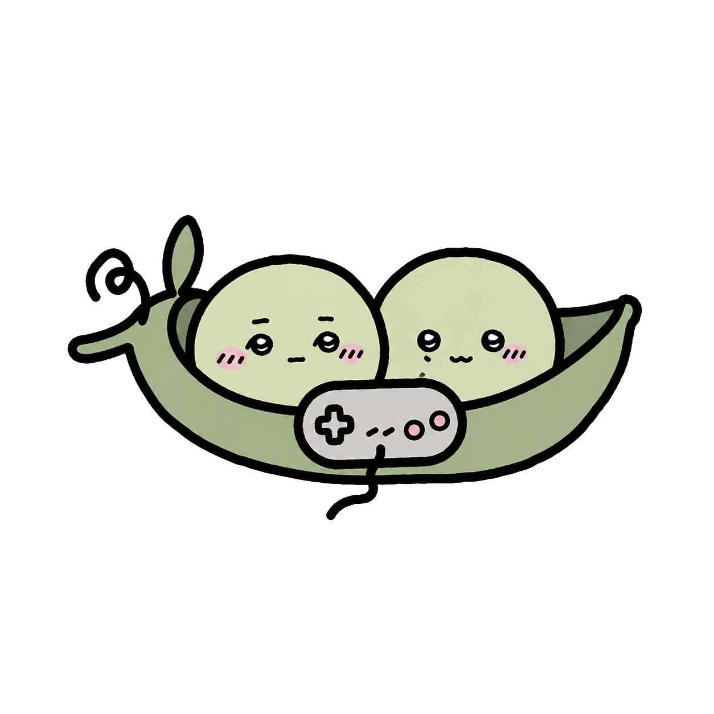

# unpolished-peas

<div align="center">
    
</div>

Small Zig 2D engine experiment.

## API Goal

unpolished-peas should feel as simple to start with as raylib, LÖVE, and Ebitengine:

- draw a sprite, play a sound, read input, and reload an asset with minimal setup.
- keep tiny games in one readable file without framework ceremony.
- make the simple path obvious, while preserving explicit Zig control flow.
- treat long examples as temporary scaffolding until the public API supports shorter ones.

## Requirements

- Zig 0.15.1 or 0.15.2
- no system SDL3 installation in the default pinned-source mode

```sh
zig build test-sdl
zig build test-renderer-conformance
zig build test-opengl
```

`zig build test-sdl` uses the pinned SDL3 source in `build.zig.zon`.
`test-renderer-conformance` runs the backend-neutral opaque and clipped command corpus plus opt-in GPU captures. CI requires the GPU captures on macOS and Linux; Windows emits its platform, drivers, and shader-format capability report when no compatible GPU backend is available. Windows runtime uses dynamically compiled DXBC shaders for the D3D backend.
`test-opengl` creates an OpenGL 3.3 core context and validates the fallback presenter with a readback fixture.
`test-renderer-cross-backend` compares SDL GPU and OpenGL readbacks for the shared corpus; captures must have equal dimensions and every RGBA channel may differ by at most one.
Desktop `sdl.Config.renderer` selects `auto`, `sdl_gpu`, or `opengl`; `--renderer <auto|sdl-gpu|opengl>` overrides it at launch. `sdl.Context.rendererDiagnostics()` reports the requested/selected backend, rejected attempts, shader and OpenGL capabilities, post-processing support, and latest recovery action; the desktop log records the same selection line.
`Config.required_renderer_features` makes startup fail before game initialization when a requested `RendererFeature` is unavailable. `Context.rendererFeatures()` reports primitive, sprite, text, clip/blend, camera, pixel-effect, screenshot, and context-recovery support for the selected backend.

The `unpolished-peas` core module has no SDL3 dependency. Import `unpolished-peas-sdl3` separately only for the desktop runtime.

Game code imports `unpolished-peas` and `unpolished-peas-sdl3`. `zig build test-modules` checks the core, tooling, and fixture graph.
The SDL runtime wires `InspectorAssetPanel`, `InspectorInputPanel`, and `InspectorMetricsPanel`; disabled developer tools retain no panels and execute no inspector rendering. Collision panels remain application-owned.

`Context.text` uses the built-in 5×7 debug font. `AssetStore.loadFont(path, options)` loads TrueType/OpenType fonts into a GPU atlas and detects AngelCode `.fnt` descriptors; configure `FontLoadOptions.ranges` with one or more Unicode ranges. `Context.font` uses strict UTF-8 replacement and the configured fallback glyph, while `Font.textDiagnostics` exposes invalid UTF-8 and missing/fallback glyph counts. `layoutText` shares the same deterministic UTF-8 decoder.

`Image.decode` and `AssetStore.loadImage` accept PNG, JPEG, and TGA with a 32 MiB input cap, 4096×4096 dimension caps, and a 16 MiB pixel cap; pass `ImageDecodeOptions` to tighten direct decoder limits.

To use a system SDL3 instead:

```sh
brew install sdl3 pkg-config
zig build -Dsystem-sdl=true run-bounce-sdl
```

On Debian or Ubuntu, replace the `brew install` command with `sudo apt install libsdl3-dev pkg-config`.

## Tiny Start

```zig
const up = @import("unpolished-peas");
const sdl = @import("unpolished-peas-sdl3");

const Game = struct {
    pub const config: sdl.Config = .{ .width = 80, .height = 60, .scale = 6 };

    pub fn draw(_: *Game, ctx: *sdl.Context) void {
        ctx.rect(18, 18, 28, 28, up.Color.rgb(255, 198, 74));
        ctx.text("HELLO", 8, 8, up.Color.white);
    }
};

pub fn main() !void {
    try sdl.playGame(Game);
}
```

## Explicit Loop

sdl.playGame(Game) is the callback-game facade and reads window, presentation, developer, asset-root, and lifecycle configuration from Game.config. The [explicit-loop example](examples/explicit_loop.zig) is the advanced path: it owns event, update, and draw ordering with only core primitives and compiles for desktop and Wasm; the starter remains callback-based.

Set Game.config.pause_policy to .unfocused or .minimized to suppress update callbacks while that desktop state applies. Focus, minimize, restore, resize, and close stay ordered Event callbacks; draw continues with ctx.dt set to zero, leaving game state under user control.

Each unpaused frame processes input/events, runs zero or more update callbacks at fixed `1 / Config.fixed_hz` `ctx.dt`, then runs one draw callback with clamped variable `ctx.dt`; `ctx.alpha` is the remaining fixed-step fraction for draw interpolation. Frame deltas are capped at `StepClock.max_steps_per_frame * step_seconds`; paused draws receive zero `dt` and `alpha` without advancing the clock.

Set `Config.actions` to repeated `Action` entries with the same context/name to merge keyboard, mouse, and gamepad bindings. `Context.actionValue`, `actionIsDown`, `actionWasPressed`, and `actionWasReleased` read the per-frame map; `Context.rebindAction` or `Context.rebindActionBinding` persists `bindings.up` in app data.

## Starter Project

From an unpolished-peas checkout:

```sh
zig build new -- ../my-game
cd ../my-game
zig build run
```

`v0.0.3` is withdrawn: its public archive does not implement the API emitted by the current starter. `main` is an unreleased integration branch; do not distribute a project generated from it until the next non-draft tag is published. The tag workflow validates that future starters build and run from their exact public archive with empty Zig caches. See [releases and support](docs/guides/releases.md) and the [v0.1 capability matrix](docs/guides/capabilities.md).

## Positioning

- Not blank space: Mach, zig-gamedev, jok, Delve, and several small engines exist.
- Gap: no obvious widely adopted Zig equivalent of LÖVE/raylib/Ebitengine with a 2D-first API and tiny first-win path.
- Bet: win by being the fastest path from `zig build run` to a visible 2D game, with headless tests and explicit control flow.
- Non-goal: compete with Mach on broad WebGPU/full-engine scope or with zig-gamedev as a toolbox.

## Differentiators

- 2D-only first; no editor and no 3D surface until the 2D loop is excellent.
- Headless renderer for CI screenshots, examples, and deterministic tests.
- Reloadable file assets via polling `mtime`, so iteration works before native file watchers.
- Built-in debug text with no font dependency.
- Public API stays explicit: user code owns update/render order.

## Commands

```sh
zig build test
zig build test-support
zig build test-modules
zig build test-effects
zig build run-bounce
zig build run-bounce-sdl
zig build dev-bounce
zig build run-minimal
zig build run-explicit-loop
zig build test-explicit-loop-wasm
zig build run-audio
zig build run-atlas
zig build run-camera
zig build run-tilemap
zig build run-primitives
zig build run-breakout
zig build run-breakout-sdl
zig build smoke-breakout-sdl
zig build test-breakout
zig build run-topdown-sdl
zig build smoke-topdown-sdl
zig build test-topdown
zig build test-topdown-scene
zig build run-platformer-sdl
zig build smoke-platformer-sdl
zig build test-platformer
zig build test-replays
zig build benchmark
zig build benchmark-proofs
script/check_performance_budgets.sh
zig build test-scenes
zig build stress-audio-sdl
zig build new -- ../my-game
```

`run-bounce` renders `zig-out/bounce.ppm`.
`run-bounce-sdl` opens an SDL3 window.
`dev-bounce` opens a PNG/text live-reload demo.
`run-audio` opens a WAV/OGG audio demo.
`run-explicit-loop` runs the advanced core explicit-loop example; `test-explicit-loop-wasm` compiles the same source for Wasm.
`run-atlas` opens a programmatic atlas/tile scene demo.
`run-camera` opens the resizable multi-viewport camera demo.
`run-tilemap` opens the sparse tile-map and camera-culling demo.
`run-primitives` opens the GPU primitive and text-quads demo.
`run-breakout` writes the deterministic Breakout frame to `zig-out/breakout.ppm`.
`run-breakout-sdl` opens Breakout with keyboard paddle input and collision audio.
`smoke-breakout-sdl` runs two SDL frames with a dummy audio device.
`test-breakout` runs fixed-step Breakout simulation tests.
`run-topdown-sdl` opens the action-mapped programmatic TileMap top-down demo.
`smoke-topdown-sdl` runs two SDL frames with dummy audio.
`test-topdown` and `test-topdown-scene` verify deterministic simulation and rendering.
`zig build test-desktop-package-matrix` packages and smokes bounce, top-down, and platformer for the host desktop platform from raw `assets/`, with bundled SDL and no generated content cache.
`zig build test-web-proof-game-matrix` packages and smokes bounce, top-down, and platformer in Chromium from deterministic static Wasm bundles.
`run-platformer-sdl` runs the TileCollider, animation, and shader platformer slice.
`smoke-platformer-sdl` and `test-platformer` verify its bounded runtime and movement fixture.
`script/test_proof_game_matrix.sh <topdown|platformer>` runs bounded CLI, inspector, reload, profiler, headless, and desktop-smoke scenarios; CI runs its Windows equivalent on every supported desktop and retains `zig-out/diagnostics/proof-matrix/` on failure.
`fixtures/bounce-project`, `fixtures/topdown-project`, and `fixtures/platformer-project` are independent consumer packages that import `unpolished-peas` through their own manifests; `script/test_independent_proof_games.sh` builds and tests all three.
`zig build test-facade-consumer-matrix` builds independent desktop and Wasm consumer packages that use only `@import("unpolished-peas")`.
`zig build test-renderer-three-backend` compares deterministic SDL GPU, OpenGL, and WebGL 2 renderer corpus captures with a one-channel tolerance.
`zig build test-cross-target-integrity` validates desktop and Chromium failure artifacts, manifests, redaction, package files, screenshots, and recovery diagnostics.
`fixtures/external-game` is a standalone callback game that draws a sprite, plays synthesized audio, and consumes normalized input through the public desktop module.
`fixtures/external-tilemap-game` is a standalone desktop game that defines its TileMap in Zig, drives movement through configured actions, follows with a camera, and reloads a raw shader asset.
`fixtures/external-animation-game` is a standalone desktop game that animates a generated atlas, plays synthesized audio, uses swept collision, and exposes capture/CPU-trace diagnostic hooks.
`release-zig-compatibility` runs core tests, replay hashes, and independent proof-game packages on Zig 0.15.1 and 0.15.2.
`zig build test-effects` validates the engine-owned effects subsystem.
`test-replays` verifies stored fixed-step input state hashes for Breakout, top-down, and platformer on CI.
`script/record_performance_artifacts.sh` records release-mode engine and proof-game metrics under `zig-out/performance/` for investigation; `script/check_performance_budgets.sh` remains an optional local baseline check. `zig build test-desktop-backends` combines stored replay hashes and SDL GPU/OpenGL visual comparison with per-stage logs.
Tag pushes run `zig build release-gate`, which validates the frozen core API, a clean released-dependency consumer, proof-game consumers, desktop packages, deterministic diagnostics, and visual/replay checks; every gate writes a local log under `zig-out/diagnostics/release-gate/`.

`zig build peas -- package <linux|macos|windows|web> [output-directory] [--game <bounce|topdown|platformer>]` writes a portable package; web emits a static Wasm bundle with host modules, assets, manifest, and SHA-256 inventory, and `zig build peas -- serve [bundle-directory] [--port <1-65535>]` serves it only on localhost.
`test-scenes` compares deterministic headless, bounce, top-down, and platformer renders against committed PNG goldens; `zig build test-scenes -- --update-golden` refreshes all captures intentionally.
`stress-audio-sdl` runs a local SDL audio stress smoke.
`zig build peas -- new <directory>` creates the bouncing-square starter project; it writes a standalone build, source, assets, and build-manifest layout without replacing an existing destination.
`zig build peas -- check [project-directory] [--target <linux|macos|windows>]` statically validates the manifest Zig minimum, project build script, `assets/`, and selected runtime target without starting the game; Windows checks require Windows 10/11 x64 with `D3DCompiler_47.dll`; failures include a recovery command.
`assets/` contains user-owned raw files. Define atlas frames, animations, and TileMaps directly in Zig beside the game code; there is no engine-owned content format or compiler.
`zig build peas -- test <unit|replay|visual|integration> [project-directory]` runs the selected deterministic test target and identifies its build artifact directory on failure.
`zig build peas -- replay <fixture.upr> [expected-input-hash]` reproduces normalized fixed-step input and reports a deterministic final-state hash or divergence.
`zig build peas -- support-bundle <diagnostics-directory> <output-directory> [--include <artifact>]... [--redact <literal>]... [--redact-path <path>]...` creates a local, allowlisted diagnostics export. Text artifacts redact the source path plus configured literal paths and secrets; PNG captures copy unchanged. The command never transmits or uploads data.
`zig build peas -- doctor [project-directory] [--target <linux|macos|windows|web>] [--renderer <auto|gpu|opengl>] [--package <linux|macos|windows|web>]` validates project, Zig, target, renderer, assets, Node browser host, and package prerequisites. Exit codes are deterministic: 20 project, 21 Zig, 22 target, 23 renderer, 24 assets, 25 browser host, 26 package.
Prefix any `peas` workflow with `--json` for one versioned stdout result object (`command`, `status`, `recovery_code`, `non_interactive`); diagnostics remain on stderr. Prefix with `--non-interactive` to disable inherited stdin for child tools; `run` and `serve` reject that mode with exit code 65.
`zig build peas -- package <linux|macos|windows|web> [output-directory] [--game <bounce|topdown|platformer>]` creates the selected portable package through the project CLI.
`zig build peas -- docs [overview|quickstart|testing|api]` emits offline Markdown documentation and prints its local path; `zig build test-docs` validates runnable-example links.
`zig build peas -- run [project-directory] -- [game-args]` discovers the project from the selected path, validates `assets/`, and starts the Debug runtime with forwarded game arguments.
When `peas run` or `peas test` encounters a known Zig engine/config diagnostic, it preserves the native text and appends a concise `peas recovery` hint.

Mixer playback supports `pan`, `setPlaybackPan`, and sample-frame `fadePlayback`; OGG music preallocates a bounded decode buffer, and SDL output reopens after device removal or format changes without resetting mixer playback state.

Bundled read-only assets resolve from `assets/` beside the executable or one directory above it; `UP_ASSET_ROOT` or absolute `Config.asset_root` override this for development and embedding. Writable data uses `Context.appDataPath`.

## Developer Runtime

`Config.developer_tools` defaults to enabled in Debug builds. F3 toggles the FPS/frame-time overlay. F12 writes a PNG read back from the composed GPU render target. `Context.captureFrame()` requests the same capture after the current frame. The app-data path is printed at startup, available through `Context.appDataPath`, and contains `unpolished-peas.log` when developer tools are enabled.

`Context.toggleInspector()` shows the selected diagnostic panel; Tab cycles assets, input, metrics, renderer capabilities, asset reload, bindings, profile, and subsystem state. `Context.nextInspectorPanel()` and `Context.previousInspectorPanel()` provide explicit navigation. `InspectorSubsystemPanel.copyableDiagnosticsPath()` returns the local diagnostics path for clipboard integration.

Game initialization, event, update, draw, GPU-recovery, and asset-reload errors include their phase and log path in the terminal, are written to the app-data log, then stay in an in-window error state until Escape or close. A GPU reset rebuilds presenter resources and invalidates prior handles; a GPU loss reports a terminal recovery failure. Zig panics remain process failures and require the normal debugger/test workflow.

`Config.cpu_profiler` defaults to Debug builds. The runtime retains a bounded rolling multi-frame trace with frame markers, callback/update/draw/asset scopes, named game scopes from `ctx.profileNamed("name")`, and counters from `ctx.profileCounter("name", value)`. Inspect `ctx.profileMetrics()`, call `ctx.exportCpuTrace()`, or call `ctx.exportCpuTraceNamed("label")` to write Chrome Trace JSON to the app-data directory.

`ctx.runtimeMetrics()` reports the last completed frame's CPU encoder time, pass and batch counts, texture and audio-buffer usage, plus resource/allocation churn. Hardware GPU timing is `null` because this SDL runtime does not issue timestamp queries; the developer inspector renders that state explicitly.

Runtime failures write bounded local diagnostics: versioned `metadata.json`, `screenshot.png`, `commands.json`, `trace.json`, and `failure.log`. Golden/replay test failures add deterministic diagnostics under `zig-out/diagnostics`; set `UP_DIAGNOSTICS_ROOT` to redirect runtime captures for CI. Diagnostics are local artifacts and contain no transmitted telemetry.

SDL sprite textures upload on first use; changed image or atlas buffers stage a replacement upload before the prior GPU resource is released, and unused sprite resources expire after 120 rendered frames. Atlas draws preserve source regions, origin, scale, rotation, flips, tint, and nearest or linear sampling through the GPU path.

GPU command primitives use one logical-pixel strokes, 32-segment circles, and source-over or additive blending. `Context.pushClip`/`popClip` and `pushBlend`/`popBlend` nest and restore command state.

`TileCollider.addShape` and `addLayer` are the default collision path. `addLayer` derives deterministic solid geometry from an explicit tile, IntGrid, or object layer; failures leave the existing collider unchanged. Object/layer `one_way=true` surfaces are pass-through from below; polygon and polyline edges provide walkable slopes. `CharacterController.move` is a swept, bounded-step controller with grounded, wall, and ceiling state.

`up.effects` owns shader programs, pixel effects, and post-process chains. `Context.loadShader` loads `.upshader` source; `Context.setShaderEffect` validates and replaces the post-process chain, while `Context.appendPixelEffect` appends a pass. Passes execute in declared order through owned ping-pong targets, screenshots capture the final target, and `effects.applyPixelEffect` is the headless fallback.

## Camera And Presentation

`Camera2D` provides position, zoom limits, rotation, viewport rectangles, world bounds, nearest or bilinear image sampling, pixel snapping, dead-zone follow, spring motion, deterministic shake, coordinate conversion, visibility checks, and parallax copies. `CameraRig` owns an arbitrary number of generation-checked cameras; `CameraDirector` plays deterministic cuts and blended shots.

Use `ctx.camera(&camera)` for world rendering. It transforms and clips rectangles, circles, lines, images, atlas frames, and text to the camera viewport. Use the existing `ctx` drawing calls for HUD rendering.

SDL windows support `Config.resizable` and `.stretch`, `.fit`, or `.integer_fit` presentation. `Input.pointer` exposes window, physical framebuffer, and optional logical-canvas coordinates; letterbox bars map to `null` canvas coordinates.

## Current API

- `Vec2`, `Rect`
- `Color`
- `Input`, `Key`
- `Pointer`, `PointerButton`
- `Action`, `ActionBinding`, `ActionMap`
- `FontGlyphRange`, `FontTextDiagnostics`
- `StepClock`
- `Canvas`, `Sprite`
- `Canvas.drawImage`
- `Canvas.drawAtlasFrame`
- `Canvas.drawText`
- `Camera2D`, `CameraCanvas`, `CameraRig`, `CameraDirector`
- `TileMap`, `TileMapLayer`, `TileMapLayerKind`, `TileMapObject`, `TileMapObjectShape`, `TileMapProperty`, `TileSet`
- `TileCollider`, `CharacterController`
- `Presentation`, `PresentationMode`
- `AssetFile`
- `AssetStore`
- `Image`
- `Atlas`
- `AtlasFrameHandle`, `AtlasFrameSpec`, `AtlasAnimationFrameSpec`, `AtlasAnimationSpec`
- `AnimationPlayer`
- `AnimationStateMachine`, `AnimationState`, `AnimationTransition`, `animationState`
- `FrameProfiler`, `ProfileScope`, `ProfileMetrics`, `profiler`
- `RuntimeMetrics`, `InspectorMetricsPanel`, `runtimeMetrics`

`effects.lighting(core).Pipeline.append` emits GPU primitive commands; `render` is the explicit headless fallback selected by `Pipeline.preferredPath`.

- `Sound`
- `Music`
- `AudioMixer`
- `BusHandle`
- `PlaybackHandle`
- `unpolished-peas-sdl3.playGame`, `unpolished-peas-sdl3.Context`
- `unpolished-peas-sdl3.run` for lower-level control
- `unpolished-peas-sdl3.appDataPath`

## Next Build Targets

1. Publish `v0.0.4` only after the release contract validates the generated starter against its exact public tag archive.
2. Keep the 2D core and its release contract stable before expanding the public engine surface.
3. Make additional platform support conditional on reproducible runtime and package coverage.
