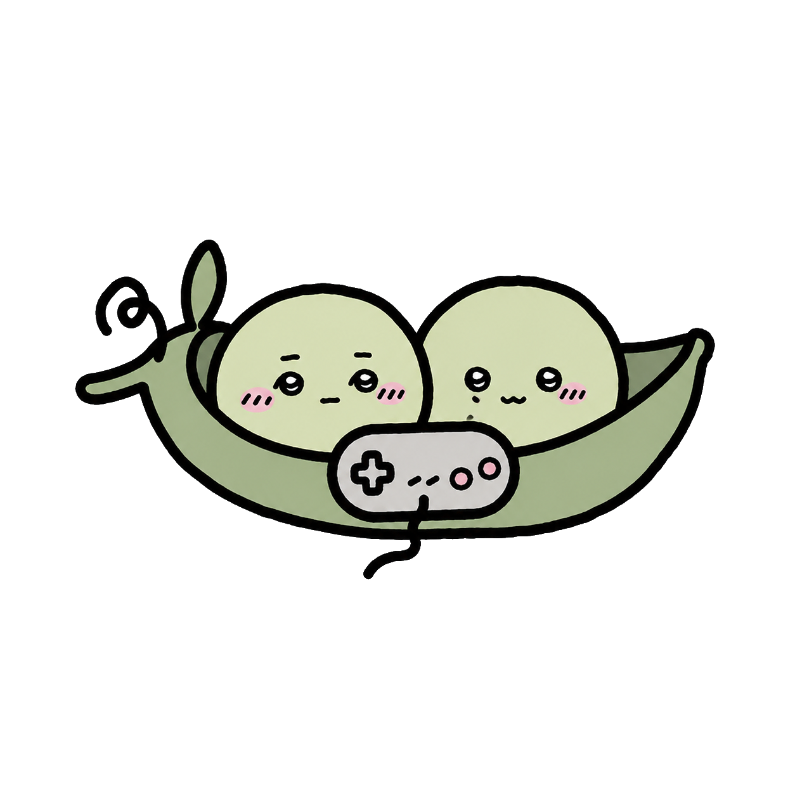

# unpolished-peas

<div align="center">
    
</div>

A small Zig framework for deterministic, testable 2D games. Peas is for
small authored games that benefit from a fixed update loop, headless tests,
replayable input, and one Zig-first native/browser codebase.

## Start here

Requires Zig `0.15.2`. The intended first public release is `v0.1.0`, but no
immutable package has been published. Do not use `main` as a dependency.

New to Peas?

1. Follow the [5–10 minute Start Here guide](docs/guides/quickstart.md).
2. Read and run [Seed Sprint](templates/starter/README.md), the canonical
   beginner project.
3. Use [Neon Siege](dogfood/neon-siege/README.md) later as a larger
   public-API reference. Then read
   [Lantern Leap](dogfood/lantern-leap/README.md) for a mechanically different
   scrolling-platformer reference that keeps collision and level rules in
   ordinary game code.

From this repository checkout, verify the starter's real game/test paths:

```sh
zig build test-starter -Dwith_sdl=false
zig build run-starter
```

The checked-in template intentionally has no fake release URL/hash. See
[installation](docs/guides/installation.md) for the explicit unreleased status
and the eventual immutable-package workflow.

## When Peas fits

Use Peas for small authored 2D games, deterministic simulations, strong
headless testing, simple Canvas rendering, and native/browser deployment.
It deliberately does not provide an engine-owned ECS, physics, 3D renderer,
editor, networking stack, large UI framework, or general scene hierarchy.

## Platform evidence

The [platform status](docs/guides/platforms.md) page is the single canonical
record of build/package and runtime evidence. The
[capability matrix](docs/guides/capabilities.md) separately defines
renderer/browser contract and CI coverage; neither table substitutes for the
other.

## What you will use most

- `sdl.playGame(Game)` runs a `GameProtocol` game.
- `GameContext` provides input, Canvas, allocator, and optional save/audio
  capabilities.
- `ctx.requireCanvas()` returns the logical-pixel 2D canvas.
- `ctx.requireSaveData()` returns a host-owned opaque-byte save store.
- `Canvas` draws rectangles, sprites, text, clips, and blends.
- `RenderSurface` owns an offscreen Canvas for deterministic 2D composition.
- `Config` controls window, fixed timestep, presentation, renderer, and
  optional runtime assets.

The [learning path](docs/index.md) orders the guides; do not start with the
core contract or advanced renderer reference unless you need their details.

## Which example should I read?

| Need | Read |
| --- | --- |
| First Peas game | [Seed Sprint](templates/starter/README.md) |
| Minimal lifecycle | [tutorial GameProtocol example](examples/tutorial_game_protocol.zig) |
| Complete reference game | [Neon Siege](dogfood/neon-siege/README.md) |
| Scrolling platformer reference | [Lantern Leap](dogfood/lantern-leap/README.md) |
| Replay/state/Canvas regression | [testing guide](docs/guides/testing.md) |
| Advanced materials or particles | [advanced 2D guide](docs/guides/advanced-2d.md) |

## Release and local docs

Published generated projects will pin one immutable archive URL and matching
hash. No current tag provides that coordinate; see the
[installation guide](docs/guides/installation.md) and
[release policy](docs/guides/releases.md).

Run `zig build docs` for offline documentation, or `zig build peas -- docs quickstart` to locate its local path. The [docs index](docs/index.md) links testing, platform, API, and migration details.
