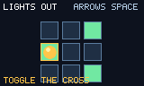

# Puzzle proof game



`examples/puzzle_game.zig` is a hand-owned 3×3 Lights Out rule set: bounded selection, action-mapped movement, rising-edge cross toggles, solved detection, and deterministic tests. `examples/puzzle_sdl.zig` owns the callback loop, raw image/sound assets, and presentation. No game-specific core API, ECS, physics, tiles, persistence, content compiler, or hidden engine hook is used.

## Setup and checks

```sh
zig build test-puzzle
zig build test-puzzle-scene
env SDL_AUDIODRIVER=dummy zig build smoke-puzzle-sdl
script/test_puzzle_native_fixture.sh
script/test_proof_game_matrix.sh puzzle
script/test_web_package.sh puzzle
script/test_browser_chromium.sh puzzle
```

`test-puzzle-scene` compares the deterministic frame to the PNG above. Refresh intentionally with `zig build test-puzzle-scene -- --update-golden`.

Desktop packages use `zig build peas -- package <linux|macos|windows> OUT --game puzzle`. The capability matrix has package and proof-game lanes for macOS, Linux, and Windows. This checkout locally passed the macOS universal package, SDL GPU/OpenGL smokes, and package-layout recovery check; Linux and Windows remain remote-matrix evidence until that CI is run.

`script/package_web.sh OUT --game puzzle` builds a puzzle-specific Wasm adapter. It parses normalized browser input, advances `examples/puzzle_game.zig`, and draws only through the shared rectangle contract. Local captures passed Chromium WebGL2, Chromium WebGPU, and Firefox WebGL2; Safari requires its local WebDriver remote-automation setting and is not verified here.

## Performance result

`zig build -Doptimize=ReleaseFast benchmark-proofs` records a `puzzle` workload beside `bounce`: Canvas allocation at startup plus a fixed 240-frame loop that executes input, rule update, nine filled/stroked cells, and text. The macOS arm64 ReleaseFast run for this change reported startup `16726 ns`, `2` allocations / `61560 B`, and `9727 ns` per frame with `240` allocations / `28800 B` across the loop. The one allocation / `120 B` per rendered frame is the shared text path, matching the existing bounce workload. Existing reviewed baseline limits remain bounce-only until puzzle results are reviewed on every required native target. Values are target-specific and are not portable frame-rate claims.

## Limitations

The proof intentionally ships one fixed 3×3 board, no level selection, undo, hints, persistence, animation system, or accessibility remapping UI. Native presentation uses `ball.png` as a selection marker and `blip.wav` on toggles. Browser presentation uses contract rectangles and host-level audio coverage, so it does not render that native image marker or play the desktop sound effect.
