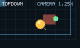

# Top-down proof game



`examples/topdown_game.zig` owns movement, aim, shots, and bounds. `examples/topdown_sdl.zig` owns audio, asset loading, and a `Camera2D` centred on the player. The world is hand-authored rectangles, lines, and markers; it has no ECS, physics, tiles, collision, particles, or engine-owned world data.

## Setup and checks

```sh
zig build test-topdown
zig build test-topdown-scene
env SDL_AUDIODRIVER=dummy zig build smoke-topdown-sdl
script/test_topdown_native_fixture.sh
script/test_proof_game_matrix.sh topdown
```

`test-topdown-scene` compares the deterministic scene to the committed PNG above. Refresh it intentionally with `zig build test-topdown-scene -- --update-golden`.

Desktop packages are selected with `zig build peas -- package <linux|macos|windows> OUT --game topdown`; each package script stages raw assets and the top-down executable. The capability matrix runs the supported desktop lanes on macOS, Linux, and Windows.

## Performance result

`script/check_performance_budgets.sh` measures the versioned 160×90 stable-core workloads and checks their reviewed native limits. The top-down scene exercises the same primitive, sprite, text, and camera paths at 160×96. Its update/draw methods do not call asset-loading APIs. Run the command on the target being evaluated; values are target-specific and are not portable frame-rate claims.

## Limitations

The game deliberately has no collision, tile map, camera controller, combat system, persistence, or content pipeline. The static web `--game topdown` package currently verifies the shared browser host, renderer, input, audio, capture, and package artifact; it does not bundle `examples/topdown_game.zig` as its browser game. Therefore browser proof-game coverage is not sufficient to claim that the top-down gameplay itself runs in WebGL 2 or WebGPU.
